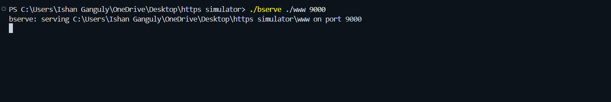
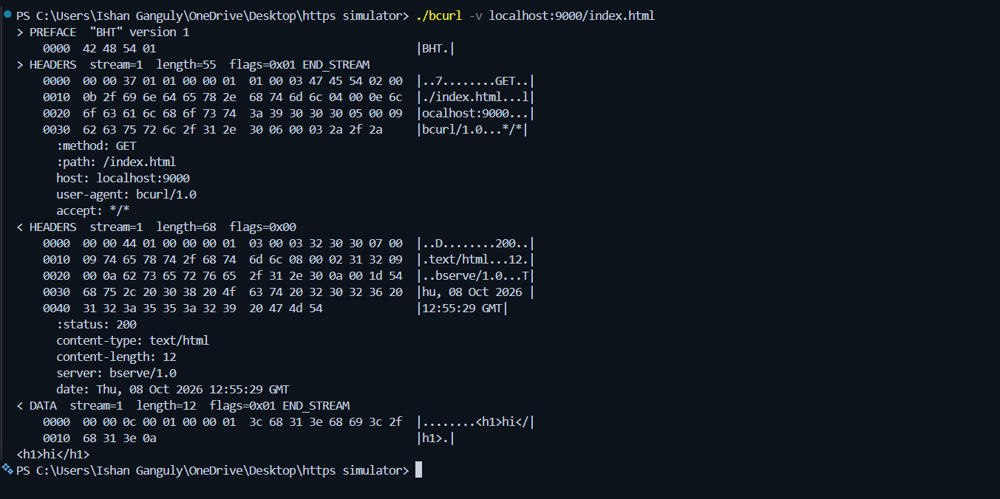
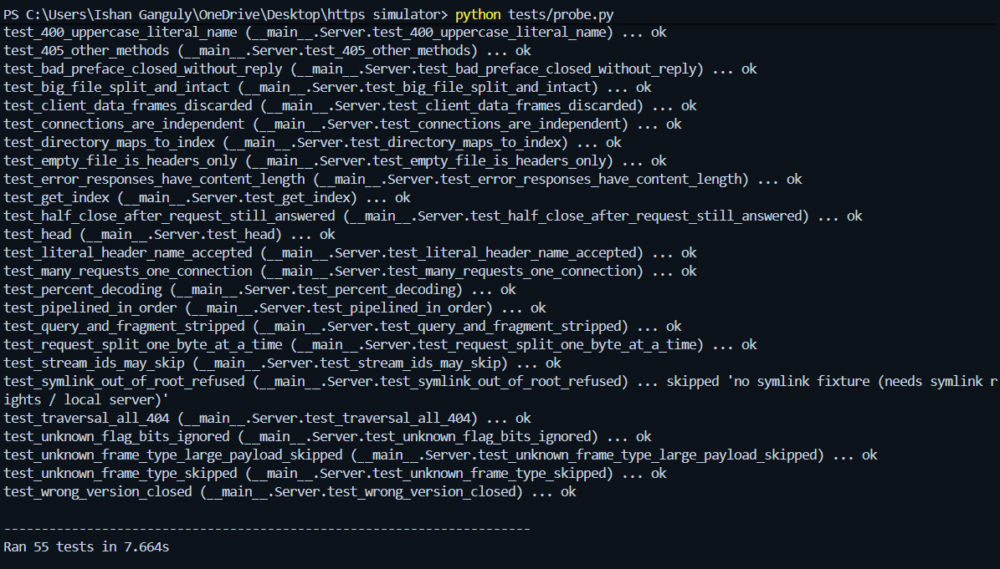

# BHT/1: HTTP in binary frames

A small binary protocol that carries HTTP requests and responses, plus the two
programs that speak it:

- **`bserve`**, a static file server;
- **`bcurl`**, a command-line client.

Instead of text lines such as `GET /index.html HTTP/1.1`, every message is a
binary **frame** with a fixed 8-byte header. Header names are shrunk to 1-byte
codes. One TCP connection carries as many requests as you like.

The protocol itself is defined in **[SPEC.md](SPEC.md)**, which is two pages.
Everything here was built from that document alone. The server and the client
share no code, so they only work together if the spec is right.

---

## Project structure

```text
.
├── SPEC.md          the protocol: two pages, enough to build a compatible program
├── HEXDUMP.md       one real request and response, annotated byte by byte
├── README.md        this file
├── bserve           the server   (Python 3, run as ./bserve)
├── bcurl            the client   (Python 3, run as ./bcurl)
├── www/             sample files to serve
│   ├── index.html   12 bytes, the same file used in SPEC.md and HEXDUMP.md
│   ├── sub/index.html
│   ├── empty.txt    0 bytes: tests a response with no body
│   └── big.bin      40,000 bytes: tests a body split across several frames
├── tests/
│   └── probe.py     55 automated tests (server, client, and the two together)
└── screenshots/     images used in this README
```

`bserve` and `bcurl` have no `.py` extension because the assignment names the
commands that way. Line 2 of each file is a small launcher: it runs the file
with `python3`, or `python` if that is all there is.

## Requirements

Python 3.8 or newer. There are no packages to install: only the standard
library is used.

---

## Quick start

**1. Start the server.** Give it the folder to serve and a port:

```console
$ ./bserve ./www 9000
bserve: serving /path/to/project/www on port 9000
```



**2. In a second terminal, fetch a file:**

```console
$ ./bcurl localhost:9000/index.html
<h1>hi</h1>
```

The body goes to stdout untouched, so binary files can be saved directly:

```console
$ ./bcurl localhost:9000/big.bin > copy.bin
$ cmp copy.bin www/big.bin && echo identical
identical
```

**3. See the frames.** `-v` prints a hexdump of every frame, in both
directions, to stderr. `>` marks frames sent and `<` marks frames received.
stdout still contains only the body.

```console
$ ./bcurl -v localhost:9000/index.html
> PREFACE  "BHT" version 1
    0000  42 48 54 01                                       |BHT.|
> HEADERS  stream=1  length=55  flags=0x01 END_STREAM
    0000  00 00 37 01 01 00 00 01  01 00 03 47 45 54 02 00  |..7........GET..|
    0010  0b 2f 69 6e 64 65 78 2e  68 74 6d 6c 04 00 0e 6c  |./index.html...l|
    0020  6f 63 61 6c 68 6f 73 74  3a 39 30 30 30 05 00 09  |ocalhost:9000...|
    0030  62 63 75 72 6c 2f 31 2e  30 06 00 03 2a 2f 2a     |bcurl/1.0...*/*|
      :method: GET
      :path: /index.html
      host: localhost:9000
      user-agent: bcurl/1.0
      accept: */*
< HEADERS  stream=1  length=68  flags=0x00
    ...
      :status: 200
      content-type: text/html
      content-length: 12
      server: bserve/1.0
      date: Tue, 06 Oct 2026 12:23:10 GMT
< DATA  stream=1  length=12  flags=0x01 END_STREAM
    0000  00 00 0c 00 01 00 00 01  3c 68 31 3e 68 69 3c 2f  |........<h1>hi</|
    0010  68 31 3e 0a                                       |h1>.|
<h1>hi</h1>
```



[HEXDUMP.md](HEXDUMP.md) explains every one of those bytes.

On Windows PowerShell, which cannot run `./bserve` directly, put `python` in
front: `python bserve .\www 9000` and `python bcurl localhost:9000/index.html`.

---

## Several requests, one connection

Give `bcurl` several URLs. They all travel over a single connection, one after
another. `bcurl` never opens a second connection.

```console
$ ./bcurl localhost:9000/index.html localhost:9000/missing.html localhost:9000/sub/
<h1>hi</h1>
404 Not Found
bcurl: /missing.html: 404
<h1>sub</h1>
$ echo $?
4
```

The server's log shows the single connection:

```text
[::1:63450] connected
[::1:63450] #1 GET /index.html -> 200
[::1:63450] #2 -> 404 (GET /missing.html)
[::1:63450] #3 GET /sub/ -> 200
[::1:63450] closed
```

## `bcurl` options and exit codes

| Option | Effect |
|---|---|
| `-v` | Hexdump every frame to stderr. DATA payloads longer than 256 bytes are cut short. |
| `-vv` | Like `-v`, but shows every byte. |
| `-I` | Send `HEAD` and print the response headers instead of the body. |

The port defaults to 9000 if you leave it out. IPv6 addresses work in
brackets, for example `[::1]:9000/index.html`.

| Exit code | Meaning |
|---|---|
| 0 | Every response was a success (1xx–3xx). |
| 4 | The worst response was a 4xx, such as 404. |
| 5 | At least one response was a 5xx. |
| 1 | Usage error, connection failure, or a server that broke the protocol. |

## What `bserve` answers

| Status | When |
|---|---|
| 200 | The file exists under the served folder. A folder path such as `/sub/` serves its `index.html`. |
| 400 | The request frame is malformed: a broken header block, a missing `:method` or `:path`, and so on. |
| 404 | The file does not exist, or the path tries to leave the served folder (`/../secret`, `/%2e%2e/secret`, …). |
| 405 | A method other than `GET` or `HEAD`. |

After any of these, **the connection stays open** for the next request. Only a
client that does not start with the BHT/1 preface is disconnected.

---

## Running the tests

```console
$ python tests/probe.py
...
Ran 55 tests in 13.210s

OK (skipped=1)
```



The suite starts its own `bserve` on a free port and serves temporary test
files. It stops the server when it finishes. It contains:

- **Server tests (36):** sends raw bytes and checks the answers. Covers every
  400 case followed by a 200 on the same connection, unknown frame types being
  skipped, requests sent one byte at a time, three requests sent at once, and
  21 attempts to escape the served folder.
- **Client tests (16):** runs `bcurl` against a deliberately awkward fake
  server. That server sends unknown frame types, frames for other streams, and
  bodies split into pieces. It also counts connections, to prove `bcurl`
  opens exactly one.
- **Interop tests (3):** `bcurl` fetching real files from `bserve`.

The one skipped test checks a symbolic link that points outside the served
folder. Python can only create one on Windows when Developer Mode is on. On
Linux and macOS it runs.

`tests/probe.py` has its own encoder and decoder, written from SPEC.md, so it
checks both programs against the spec rather than against each other.

### Testing against another team's programs

The assignment's test is that your client works with someone else's server,
and the other way round. The same suite can run against theirs:

```console
$ python tests/probe.py --client "path/to/their/client"     # their client
$ python tests/probe.py --make-fixtures /tmp/fx              # make test files,
$ their-server /tmp/fx/root 9500                             # serve them,
$ python tests/probe.py --server 127.0.0.1:9500              # test their server
```

Tests that check `bcurl`'s own choices, such as its exact exit codes, are
skipped automatically for other clients.

---

## Design in brief

The full reasoning is in [SPEC.md](SPEC.md). In short:

- **8-byte frame header: length 24 bits, type 8, flags 8, stream ID 24.** The
  length field caps a frame at 16 MiB, which bounds what a receiver must buffer.
  The header is exactly one 64-bit word. HTTP/2 uses 24/8/8/31 because its
  stream IDs are never reused and both sides open streams. BHT/1 needs neither.
- **Unknown frame types are skipped, never rejected.** Every frame states its
  length in the same place, so any receiver can step over a frame it does not
  understand. That is what leaves room for a version 2.
- **Headers: the ten names actually sent get 1-byte codes. Any other name is
  written out with a length prefix.** These are the first two mechanisms of
  HPACK, HTTP/2's header compression.
- **Errors fail one request, not the connection.** Because the framing can
  never lose its place in the byte stream, a malformed request gets a 400 and
  the next request still works.
